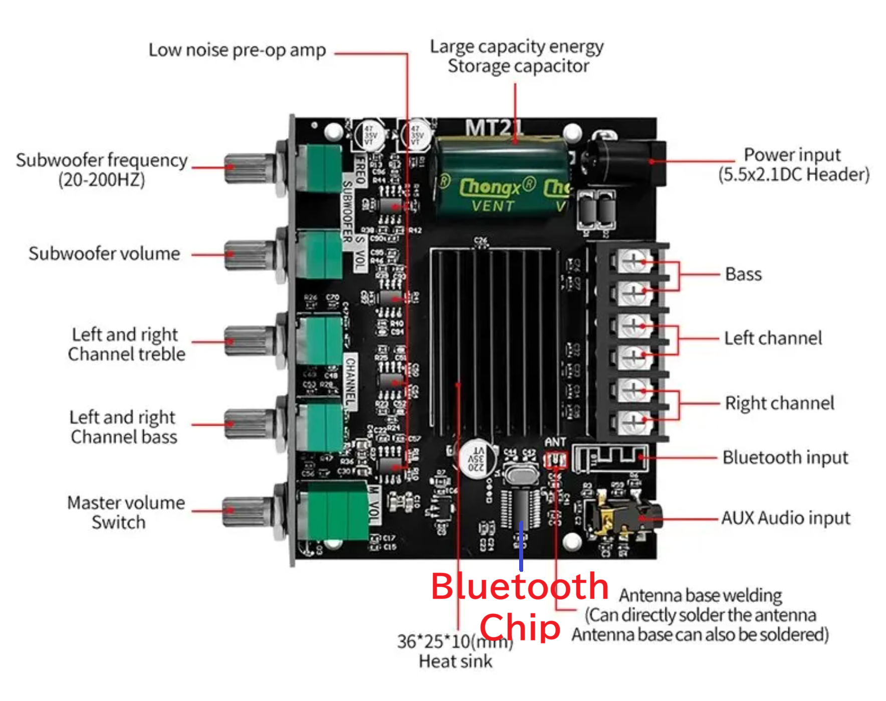

# How to remove bluetooth from ZK-TB21 or ZK-MT21

## ZK-TB21 is 2.1ch power amplifier. 

 

## ZK-MT21 is 2.1ch power amplifier. 

 

## Bluetooth chip is JL AC23BP. No datasheet available. 

 

## Remove the chip from the board. 

 

## Removed IC. 

 

## Short the power signal. 
> short IC pin No 6 and C9. 
<table>
  <tbody>
    <tr><td>Pin 6</td><td><-- short --></td><td>C9</td></tr>
  </tbody>
</table>
* M5350B regulator is MST5350BTS. 35v to 5v. 

 

## Bypass audio signal. 
> short C2 and C15. Left audio channel signal. 
> short C3 and C17. Right audio channel signal. 
<table>
  <tbody>
    <tr><td>C2</td><td><-- short --></td><td>C15</td></tr>
    <tr><td>C3</td><td><-- short --></td><td>C17</td></tr>
  </tbody>
</table>

 
 

## Board with Bluetooth removed. 

 

## AC23BP chip pin layout
<table>
  <thead>
    <tr>
      <th colspan="4">AC23BP</th>
    </tr>
  </thead>
  <tbody>
    <tr><td>1</td><td>unknown</td><td>24</td><td>unknown</td></tr>
    <tr><td>2</td><td>unknown</td><td>23</td><td>unknown</td></tr>
    <tr><td>3</td><td>unknown</td><td>22</td><td>unknown</td></tr>
    <tr><td>4</td><td>unknown</td><td>21</td><td>unknown</td></tr>
    <tr><td>5</td><td>unknown</td><td>20</td><td>unknown</td></tr>
    <tr><td>6</td><td>Power signal</td><td>19</td><td>unknown</td></tr>
    <tr><td>7</td><td>R signal out</td><td>18</td><td>Vcc</td></tr>
    <tr><td>8</td><td>L signal out</td><td>17</td><td>unknown</td></tr>
    <tr><td>9</td><td>unknown</td><td>16</td><td>unknown</td></tr>
    <tr><td>10</td><td>unknown</td><td>15</td><td>unknown</td></tr>
    <tr><td>11</td><td>GND</td><td>14</td><td>L signal in</td></tr>
    <tr><td>12</td><td>unknown</td><td>13</td><td>R signal in</td></tr>
  </tbody>
</table>

## Cheat sheet

> <table>
>   <tbody>
>     <tr><td>Pin 6</td><td><-- short --></td><td>Pin 18</td></tr>
>     <tr><td>Pin 7</td><td><-- short --></td><td>Pin 13</td></tr>
>     <tr><td>Pin 8</td><td><-- short --></td><td>Pin 14</td></tr>
>   </tbody>
> </table>
